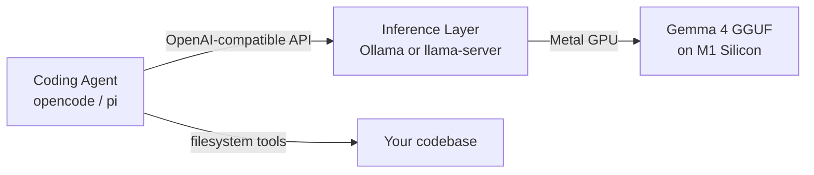

# Gemma 4 Locally on MacBook Air M1 as a Coding Agent

Gemma 4 is Google's April 2026 open-weight model family (Apache 2.0). It runs
well on Apple Silicon via llama.cpp and pairs with terminal-based coding agents
that speak the OpenAI-compatible API. This document covers model selection,
inference setup, and two coding agent options: **OpenCode** and **pi**.

## Model Variants

| Variant     | Params (active) | Context | RAM needed | Coding highlight               |
|-------------|-----------------|---------|------------|--------------------------------|
| E2B         | 2.3B / 5.1B MoE | 128K    | ~3–4 GB    | Fits 8 GB comfortably          |
| E4B         | 4.5B dense      | 128K    | ~5–6 GB    | Best size/quality on M1        |
| 26B-A4B     | ~4B active MoE  | 256K    | ~17–18 GB  | Near-31B quality, MoE savings  |
| 31B         | 30.7B dense     | 256K    | 20+ GB     | Best quality; needs 32 GB Mac  |

**Coding benchmarks (instruction-tuned):**

| Model      | HumanEval | LiveCodeBench v6 | Codeforces ELO |
|------------|-----------|------------------|----------------|
| Gemma 4 31B | 94.1%    | 80.0%            | 2,150          |
| GPT-4o     | 90.2%     | —                | —              |
| Claude 3.5 Sonnet | 92.0% | —            | —              |
| Gemma 4 E4B | —        | 52.0%            | —              |

All variants support native tool calling and multimodal input (text + image).
E2B and E4B also support audio input.

## Which Variant for M1 MacBook Air

Apple Silicon uses unified memory — GPU and CPU share the same pool. llama.cpp
offloads all layers to Metal (`-ngl 99`), so model weights + KV cache come
directly out of the RAM budget available to your apps.

Approximate memory at 32K context (weights + KV cache):

| Model   | Quant   | Weights | KV cache (32K) | Total inference |
|---------|---------|---------|----------------|-----------------|
| E2B     | Q8_0    | 2.3 GB  | 1.5 GB         | ~3.8 GB         |
| E4B     | Q4_K_M  | 2.5 GB  | 2.0 GB         | ~4.5 GB         |
| E4B     | Q8_0    | 4.5 GB  | 2.5 GB         | ~7.0 GB         |
| 26B-A4B | Q4_K_M  | 14 GB   | 3.0 GB         | ~17 GB          |

Normal macOS workload (browser + editor + Slack) consumes ~5–7 GB on its own.

| Your RAM | Recommended model | Quant   | Notes                                  |
|----------|-------------------|---------|----------------------------------------|
| 8 GB     | E2B               | Q8_0    | ~3.8 GB inference + 4 GB OS fits      |
| 8 GB     | E4B               | Q4_K_M  | Will swap with normal workloads open  |
| 16 GB    | E4B               | Q4_K_M  | ~10–11 GB total, comfortable           |
| 16 GB    | E4B               | Q8_0    | ~12–13 GB total, near-full quality     |
| 16 GB    | 26B-A4B           | Q4_K_M  | ~22 GB total — close everything else  |

**Practical pick:** E4B Q4_K_M on 16 GB is the sweet spot — leaves 5+ GB for
normal work. E4B Q8_0 is feasible too but leaves less headroom. On 8 GB, use
E2B; E4B will swap constantly if you have a browser and editor open.

**Thermal throttling:** M1 Air has no fan. During sustained inference (long
prompts, multi-file context) the chip throttles. Expect ~25 t/s initially
dropping to ~12–15 t/s after a few minutes of heavy use. For a coding agent
this mainly affects prefill time on large prompts — short back-and-forth is
fine.

## Inference Setup

There are two paths. **Ollama is simpler** and uses llama.cpp internally.
Use raw llama.cpp if you want finer control over quantization or compilation
flags.

### Option A: Ollama (recommended)

Ollama 0.20.0 shipped Gemma 4 support on launch day (April 3, 2026).

```bash
brew install ollama
ollama serve          # runs at http://localhost:11434
```

Download a model:

```bash
ollama run gemma4:e4b    # 9.6 GB — recommended for 16 GB M1
ollama run gemma4:e2b    # 7.2 GB — fits 8 GB M1
ollama run gemma4:26b    # 18 GB  — 16 GB M1, close everything else
```

Verify it's working:

```bash
curl http://localhost:11434/v1/chat/completions \
  -H "Content-Type: application/json" \
  -d '{"model":"gemma4:e4b","messages":[{"role":"user","content":"hi"}]}'
```

Ollama exposes an OpenAI-compatible endpoint at `http://localhost:11434/v1`,
which is what coding agents use.

### Option B: llama.cpp Directly

Use this if you want to pick specific GGUF quants from HuggingFace directly,
or want to compile llama.cpp with custom flags.

**Build llama.cpp (Metal backend for M1):**

```bash
brew install cmake
git clone https://github.com/ggml-org/llama.cpp
cd llama.cpp
cmake -B build -DGGML_METAL=ON
cmake --build build --config Release -j$(sysctl -n hw.ncpu)
```

**Download a GGUF:**

```bash
# Using huggingface-cli (pip install huggingface_hub)
huggingface-cli download bartowski/google_gemma-4-E4B-it-GGUF \
  --include "gemma-4-E4B-it-Q8_0.gguf" \
  --local-dir ~/models/gemma4-e4b
```

GGUF repos:
- `bartowski/google_gemma-4-E2B-it-GGUF`
- `bartowski/google_gemma-4-E4B-it-GGUF`
- `bartowski/google_gemma-4-26B-A4B-it-GGUF`
- `lmstudio-community/gemma-4-E4B-it-GGUF`

**Run as a server (OpenAI-compatible API):**

```bash
./build/bin/llama-server \
  --model ~/models/gemma4-e4b/gemma-4-E4B-it-Q8_0.gguf \
  --ctx-size 32768 \
  --port 8080 \
  --host 127.0.0.1 \
  -ngl 99               # offload all layers to Metal GPU
```

The server exposes `http://localhost:8080/v1` — same shape as OpenAI API.

**26B-A4B tool-calling note:** The 26B MoE variant has known quirks with
tool-call parsing in llama.cpp. If tool calls silently fail, apply the
tokenizer and tool-call template patches from the llama.cpp issue tracker,
or switch to E4B which works reliably out of the box.

## Architecture



## Coding Agent Options

Both agents talk to the inference layer via OpenAI-compatible endpoints, so
they work identically whether you use Ollama or llama-server.

### OpenCode

**GitHub:** `opencode-ai/opencode` | **Site:** https://opencode.ai

A feature-rich terminal coding agent. Go backend with a SolidJS-based TUI.
120K+ GitHub stars as of early 2026. GitHub officially partnered in January
2026; Copilot subscribers can authenticate directly.

**Install:**

```bash
npm install -g opencode-ai
# or
curl -fsSL https://opencode.ai/install | bash
```

**Configure for local Ollama** (`~/.config/opencode/opencode.json`):

```json
{
  "providers": {
    "local": {
      "name": "Local Gemma 4",
      "baseURL": "http://localhost:11434/v1",
      "apiKey": "ollama"
    }
  },
  "model": "local/gemma4:e4b"
}
```

For llama-server (port 8080), change `baseURL` to
`"http://localhost:8080/v1"` and set `"model": "local/gemma-4-E4B-it"`.

**Use it:**

```bash
cd your-project
opencode
```

OpenCode has persistent sessions, multi-file context, git-aware diffing, and
built-in tools for read/write/shell. Good choice if you want a polished
experience with a large community.

### Pi (by Mario Zechner)

**GitHub:** `badlogic/pi-mono` | **npm:** `@mariozechner/pi-coding-agent`

A minimal TypeScript/Node terminal coding harness written by Mario Zechner
(badlogicgames). Philosophy: small, hackable, no magic. Four built-in tools:
`read`, `write`, `edit`, `bash`. Session state stored as JSONL with branching.
Supports TypeScript extensions for custom tools/skills/themes.

**Install:**

```bash
npm install -g @mariozechner/pi-coding-agent
```

**Configure for Ollama** (`~/.pi/agent/models.json`):

```json
{
  "models": [
    {
      "id": "gemma4-e4b",
      "displayName": "Gemma 4 E4B (local)",
      "baseUrl": "http://localhost:11434/v1",
      "apiKey": "ollama",
      "model": "gemma4:e4b"
    }
  ],
  "defaultModel": "gemma4-e4b"
}
```

**Use it:**

```bash
cd your-project
pi
```

Pi suits you if you want a minimal, fast loop without the overhead of a large
agent framework. It's also the core behind OpenClaw.

### OpenCode vs Pi

| | OpenCode | Pi |
|---|---|---|
| Language | Go + SolidJS TUI | TypeScript / Node |
| Maturity | 120K+ stars, large community | Minimal, personal-scale |
| Tool set | Rich built-in + plugin system | 4 tools: read/write/edit/bash |
| Session persistence | Yes, history browser | JSONL with branching |
| Hackability | Config + plugins | TypeScript extensions |
| Install size | ~30 MB binary | npm package |
| Best for | Full-featured daily driver | Minimal, scriptable, hackable |

**Recommendation:** Start with **OpenCode** if you want something that works
well immediately and has a rich TUI. Switch to **pi** if you find OpenCode
too heavy or want to build custom tools on top of the agent loop.

## Quick-Start Checklist

```
[ ] Install Ollama: brew install ollama
[ ] Pull model:     ollama run gemma4:e4b
[ ] Start server:   ollama serve
[ ] Install agent:  npm install -g opencode-ai  (or @mariozechner/pi-coding-agent)
[ ] Configure:      point agent baseURL to http://localhost:11434/v1
[ ] Test:           open a project, run opencode (or pi), ask it to explain a file
```

## Context Window in Practice

128K context on E4B sounds large, but llama.cpp's KV cache for a 128K context
at Q8_0 is ~8 GB on its own. For coding sessions, set `--ctx-size 32768`
(32K) in llama-server, or in Ollama via a Modelfile:

```
FROM gemma4:e4b
PARAMETER num_ctx 32768
```

```bash
ollama create gemma4-e4b-32k -f Modelfile
ollama run gemma4-e4b-32k
```

32K is enough for most coding tasks and keeps memory pressure low on M1.
