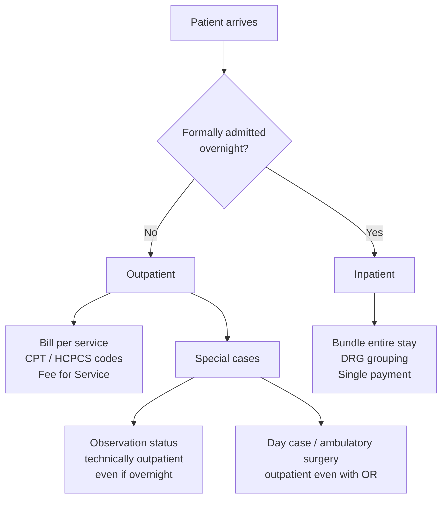
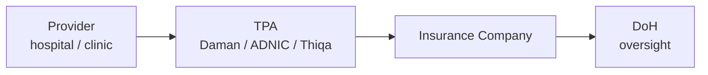
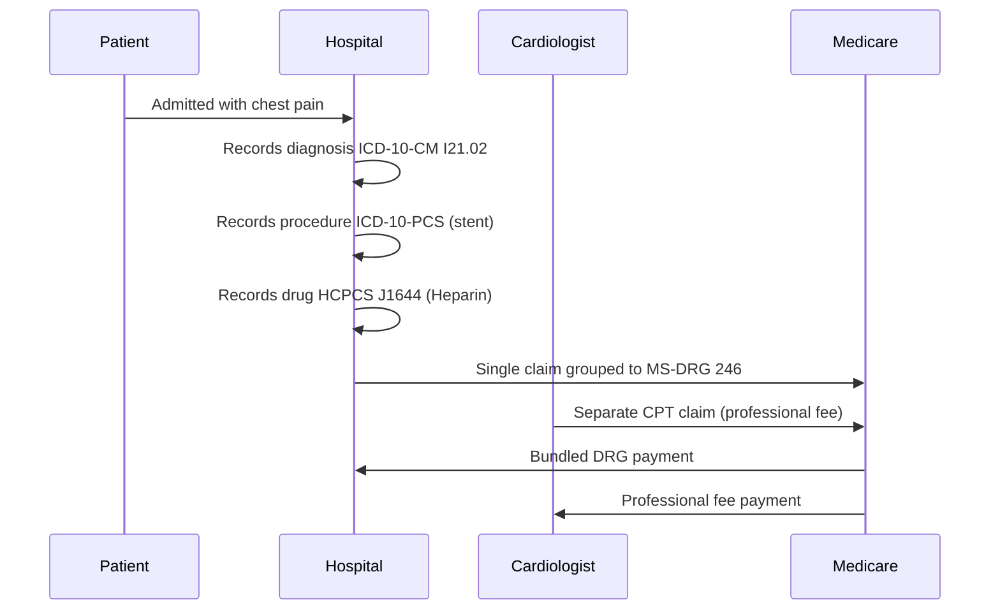

# Healthcare Coding: A Plain-English Guide

Healthcare has its own dense vocabulary of codes, systems, and acronyms.
This document explains the most common ones you'll encounter and how they
relate to each other.

## Why Codes Exist

Every time a patient sees a doctor, gets a lab test, or stays in a hospital,
that encounter needs to be described in a standardized way so that:

- **Insurance companies** know what to pay for
- **Hospitals and providers** know how to bill
- **Government agencies** can track disease trends and healthcare quality
- **Researchers** can analyze outcomes across millions of patients

Codes are that standardized language.

## Inpatient vs Outpatient

Before diving into specific code sets, you need to understand this one
distinction — it determines *which codes apply*, *who submits the claim*,
and *how the hospital gets paid*.

### Outpatient

A patient is **outpatient** when they receive care without being formally
admitted to a hospital overnight. This covers a huge range of encounters:

- A GP or specialist office visit
- An emergency room visit where the patient is treated and sent home
- A same-day surgery (e.g., a minor procedure done and the patient goes
  home the same day)
- Lab tests, imaging (X-ray, MRI), physiotherapy
- Pharmacy prescriptions

**How it's billed:** The provider (doctor, clinic, lab) submits a claim
line-by-line for each service performed. Each service gets a **CPT** or
**HCPCS** code. The payer reimburses per service — this is called
**Fee for Service (FFS)**.

**Who submits the claim:** The physician or facility submits separately.
A surgeon and the hospital can both submit claims for the same outpatient
surgery — the surgeon bills for their professional skill (CPT), the facility
bills for using the room and equipment.

### Inpatient

A patient is **inpatient** when a physician formally **admits** them to a
hospital with the expectation they'll stay at least overnight. This is a
deliberate clinical decision — not just any hospital visit qualifies.

Examples:
- Admitted for surgery with a multi-day recovery (e.g., hip replacement,
  bypass surgery)
- Admitted for a serious illness requiring monitoring (e.g., heart attack,
  stroke, sepsis)
- Admitted for childbirth

**How it's billed:** The entire hospital stay is bundled into a single
payment using a **DRG** (Diagnosis-Related Group). All the individual
services during the stay — nursing, labs, medications, procedures — are
rolled into one grouped payment. Line-by-line CPT billing does *not* apply
for the facility portion of inpatient stays.

**Who submits the claim:** The hospital submits one claim for the stay.
The attending physician(s) still submit separate professional fee claims
using CPT.

### Coding Differences by Setting

| Factor | Outpatient | Inpatient |
|--------|-----------|-----------|
| Procedure coding | CPT (+ HCPCS) | ICD-10-PCS |
| Facility payment model | Fee for Service per CPT code | Single DRG payment |
| Diagnosis coding | ICD-10-CM | ICD-10-CM |
| Claim form (US) | CMS-1500 or UB-04 | UB-04 |
| Abu Dhabi payment | CPT-based Mandatory Tariff | IR-DRG bundled payment |

### The Observation Grey Area

There is a middle category worth knowing: **observation status**. A patient
placed under observation is technically *outpatient* even if they sleep at
the hospital overnight. This matters because it affects how the hospital is
reimbursed and what the patient owes. In Abu Dhabi, DoH rules define when
observation billing applies.

### Ambulatory Surgery (Day Case)

Common in Abu Dhabi — a patient comes in, has a surgical procedure under
anaesthesia, and leaves the same day. This is **outpatient**, billed with
CPT codes, even though an operating theatre was used. Many procedures that
historically required inpatient admission (e.g., cataract surgery,
laparoscopic cholecystectomy) are now routinely done as day cases.

## Diagnosis Codes: What's Wrong With the Patient

### ICD-10-CM

**International Classification of Diseases, 10th Revision, Clinical
Modification**

The most fundamental code set in healthcare. Every diagnosis — every
condition, disease, injury, or symptom — has an ICD-10 code.

- **Who maintains it:** The World Health Organization (WHO) created ICD;
  the US uses a clinical modification (CM) managed by CMS and CDC.
- **Format:** A letter followed by numbers and sometimes a decimal.
  Examples:
  - `E11.9` — Type 2 diabetes mellitus without complications
  - `J18.9` — Pneumonia, unspecified
  - `S52.501A` — Unspecified fracture of the lower end of right radius,
    initial encounter
- **Where you see it:** Claims, medical records, prior authorizations,
  quality reporting
- **ICD-10-PCS:** A separate but related code set for *inpatient
  procedures* (CM is for diagnoses). Don't confuse the two.

**Before ICD-10:** The US used ICD-9 until October 2015. ICD-11 exists
internationally but the US hasn't fully adopted it yet.

## Procedure Codes: What Was Done to the Patient

### CPT

**Current Procedural Terminology**

The dominant code set for describing medical, surgical, and diagnostic
services performed by physicians and outpatient facilities.

- **Who maintains it:** The American Medical Association (AMA), which owns
  and licenses it.
- **Format:** 5-digit numeric codes. Examples:
  - `99213` — Office visit, established patient, moderate complexity
  - `93000` — Electrocardiogram (ECG/EKG)
  - `27447` — Total knee replacement
- **Categories:**
  - **Category I:** Standard procedures — the vast majority of codes
  - **Category II:** Performance measurement codes (supplemental)
  - **Category III:** Emerging technology and research procedures
- **Where you see it:** Physician claims, outpatient claims, ambulatory
  surgery centers

CPT codes are updated annually, with new codes added, revised, and deleted
each January.

### HCPCS

**Healthcare Common Procedure Coding System** — pronounced "hick-picks."

A two-level system that extends CPT for use in Medicare and Medicaid
billing.

- **Who maintains it:** CMS (Centers for Medicare & Medicaid Services)

**Level I:** This *is* CPT. The CPT codes are incorporated into HCPCS
Level I.

**Level II:** Alphanumeric codes for things CPT doesn't cover well:
- Durable medical equipment (DME) — wheelchairs, crutches, home oxygen
- Ambulance services
- Drugs and biologics administered in an outpatient or physician setting
- Dental and vision services
- Format: One letter + 4 digits. Examples:
  - `A4253` — Blood glucose test strips
  - `J0135` — Adalimumab injection (Humira)
  - `A0429` — Ambulance service, basic life support, emergency transport

CPT = what doctors do in their office or OR. HCPCS Level II = supplies,
equipment, and drugs that don't fit neatly into CPT.

## Facility and Inpatient Billing

### DRG

**Diagnosis-Related Group**

DRGs are used to pay hospitals for *inpatient stays*, not individual
services. Instead of billing line-by-line for every test and medication
during a hospital stay, the entire stay gets grouped into a single DRG and
the hospital receives one bundled payment.

- **Who uses it:** Medicare, Medicaid, and many commercial insurers
- **How grouping works:** A software "grouper" analyzes the patient's
  diagnoses (ICD-10), procedures (ICD-10-PCS), age, sex, and discharge
  status, then assigns a DRG.
- **Examples:**
  - `DRG 291` — Heart failure and shock with major complications
  - `DRG 470` — Major hip and knee joint replacement without complications
- **Payment:** Each DRG has a relative weight. Higher weight = more
  resources expected = higher payment. The hospital receives the same
  payment regardless of actual cost for that patient.
- **MS-DRG:** Medicare Severity DRG — the specific version Medicare uses.
  MS-DRGs often split into three tiers based on complication/comorbidity
  levels (with MCC, with CC, without CC/MCC).

DRGs create strong financial incentives. A hospital that manages a DRG-470
patient efficiently (shorter stay, fewer complications) keeps the
difference. A hospital that exceeds the expected cost absorbs the loss.

### Revenue Codes

Four-digit codes on hospital (UB-04) claim forms that describe the *type
of service* or cost center — like room and board, pharmacy, lab, or ICU.
These appear alongside HCPCS/CPT codes on institutional claims and tell the
payer *where* the service happened within the facility.

## Other Important Code Sets

### NDC

**National Drug Code**

A unique 10- or 11-digit identifier for every drug product sold in the US.

- **Format:** Labeler - Product - Package (e.g., `0069-0105-66`)
- **Maintained by:** FDA
- **Used for:** Pharmacy claims, drug tracking, Medicaid drug rebates
- On a pharmacy claim, you'll see the NDC rather than a CPT or HCPCS code.

### SNOMED CT

**Systematized Nomenclature of Medicine — Clinical Terms**

A comprehensive clinical terminology system with over 350,000 concepts
covering diseases, findings, procedures, body structures, and more.

- **Used in:** Electronic Health Records (EHRs) for clinical documentation,
  not typically for billing
- **Advantage over ICD:** Much more granular and expressive — designed for
  clinical accuracy, not just billing categories
- Often mapped *to* ICD codes for reporting and billing purposes

### LOINC

**Logical Observation Identifiers Names and Codes**

A universal standard for identifying lab tests and clinical observations.

- **Examples:** A "basic metabolic panel" or a "hemoglobin A1c" test each
  has a LOINC code
- **Used in:** Lab results in EHRs, health information exchange,
  interoperability
- Maintained by the Regenstrief Institute

### CDT

**Code on Dental Procedures and Nomenclature**

The dental equivalent of CPT — procedure codes for dental services.

- **Maintained by:** American Dental Association (ADA)
- **Format:** `D` + 4 digits (e.g., `D0120` — periodic oral evaluation)

## USCLS

**Uniform Standard Code List for Services**

If you're working in Abu Dhabi, this is highly relevant. USCLS is a DoH
Abu Dhabi-specific supplementary code set used for services that don't map
cleanly to standard CPT or HCPCS codes. Think of it as Abu Dhabi's local
extension of the standard code sets.

It is *not* a US national standard — it is specific to the Abu Dhabi
healthcare ecosystem and governed by the **Department of Health Abu Dhabi
(DoH)**.

## Abu Dhabi, UAE — What Actually Applies Here

The coding systems described in this document were largely developed in the
United States, but Abu Dhabi has formally adopted most of them.

### Regulatory Authority: DoH Abu Dhabi

The **Department of Health Abu Dhabi (DoH)** — formerly called **HAAD
(Health Authority – Abu Dhabi)** — is the body that governs all healthcare
coding, billing, and claims in the emirate. All licensed facilities must
follow DoH rules. The DoH publishes a
[Coding Manual](https://www.doh.gov.ae/-/media/Feature/shafifya/standards/coding/DOH-Coding-Manual-CSv2021.ashx)
and annual
[Claims & Adjudication Rules](https://www.doh.gov.ae/-/media/Feature/shafifya/Prices/Adjudication-Rules/DOH-Claims-and-Adjudication-Rules-V2025.ashx)
that are binding.

> Dubai has a separate authority: the **Dubai Health Authority (DHA)**.
> The northern emirates fall under the **Ministry of Health and Prevention
> (MOHAP)**. Rules differ between them.

### Code Sets Used in Abu Dhabi

| Code Set | Used in Abu Dhabi? | Notes |
|----------|-------------------|-------|
| **ICD-10-CM** | Yes, mandated | Same as the US. Used for all diagnosis coding. |
| **CPT** | Yes, mandated | Same AMA CPT codes. Outpatient and physician billing. |
| **HCPCS Level II** | Yes | Drugs, equipment, supplies — same as US usage. |
| **IR-DRG** | Yes, for inpatient | 3M International Refined DRG — same concept as MS-DRG, different variant. |
| **USCLS** | Yes, Abu Dhabi specific | DoH codes for things not covered by CPT/HCPCS. |
| **CDT** | Yes | Dental procedure codes, same usage. |
| **LOINC** | Yes | Published on Shafafiya for lab interoperability. |
| **SNOMED CT** | Yes | Available via Shafafiya for clinical documentation. |
| **NDC** | Partial | Abu Dhabi uses its own drug reference list alongside NDC. |
| **ICD-10-PCS** | Yes | Inpatient procedure coding. |

### Key Abu Dhabi-Specific Concepts

**[Shafafiya Portal](https://www.doh.gov.ae/en/shafafiya/standards)** —
The DoH's official online portal for reference code lists, price lists,
claim schemas, and coding updates. Think of it as Abu Dhabi's equivalent
of the CMS website. The
[Shafafiya Dictionary](https://www.doh.gov.ae/en/Shafafiya/dictionary)
is particularly useful for looking up specific codes.

**Mandatory Tariff List** — Abu Dhabi has a government-set price list for
services, based on CPT RVUs (relative value units). Unlike the US where
prices are heavily negotiated, Abu Dhabi has a floor price structure.

**IR-DRG vs MS-DRG** — The US uses MS-DRG (Medicare Severity DRG). Abu
Dhabi uses **IR-DRG (International Refined DRG)** from 3M, designed for
international use. The logic is the same — one bundled payment for an
inpatient stay — but the grouping weights and code mappings differ.

**eClaims** — Both Abu Dhabi (DoH) and Dubai (DHA) mandate electronic
claims submission. Paper claims are not standard practice.

**Three payer layers** — In Abu Dhabi, mandatory health insurance means
most residents are covered. Claims flow through multiple layers:

Understanding which TPA is involved matters because adjudication rules can
vary slightly between them.

## How These Systems Work Together

A Medicare patient is admitted with chest pain. Tests reveal a heart attack.
They receive a stent procedure and stay 4 days.

| Step | What Happens | Code Used |
|------|-------------|-----------|
| Diagnosis recorded | STEMI of left anterior descending artery | ICD-10-CM: `I21.02` |
| Inpatient procedure | Coronary angioplasty with stent | ICD-10-PCS |
| Drug administered | Heparin injection | HCPCS: `J1644` |
| Hospital bills | Entire stay bundled | MS-DRG: `246` |
| Cardiologist bills | Professional fee separately | CPT codes |

## Quick Reference

| Code Set | What It Codes | Who Maintains It | Used For |
|----------|--------------|-----------------|----------|
| **ICD-10-CM** | Diagnoses and symptoms | CMS / CDC | All claims, records |
| **ICD-10-PCS** | Inpatient procedures | CMS | Hospital inpatient billing |
| **CPT** | Outpatient procedures and services | AMA | Physician and outpatient claims |
| **HCPCS Level II** | Supplies, equipment, drugs | CMS | Medicare/Medicaid claims |
| **DRG / MS-DRG** | Inpatient episode grouping | CMS | Hospital inpatient payment |
| **NDC** | Drug products | FDA | Pharmacy claims |
| **SNOMED CT** | Clinical concepts (broad) | SNOMED International | EHR documentation |
| **LOINC** | Lab tests and observations | Regenstrief Institute | Lab results, interoperability |
| **CDT** | Dental procedures | ADA | Dental claims |

## Key Organizations

### Global / US

- **CMS** — Centers for Medicare & Medicaid Services. Maintains ICD-10-CM,
  HCPCS, DRG, and claims standards.
- **AMA** — American Medical Association. Owns and licenses CPT.
- **WHO** — World Health Organization. Maintains the base ICD system.

### Abu Dhabi / UAE

- **DoH** — Department of Health Abu Dhabi (formerly HAAD). Regulates all
  healthcare in Abu Dhabi; publishes the Coding Manual and Claims &
  Adjudication Rules.
- **DHA** — Dubai Health Authority. Same role as DoH but for Dubai.
- **MOHAP** — Ministry of Health and Prevention. Governs the northern
  emirates (Sharjah, Ajman, RAK, etc.).
- **Daman** — The largest health insurer / TPA in Abu Dhabi; administers
  the Thiqa scheme for UAE nationals.
- **[Shafafiya](https://www.doh.gov.ae/en/shafafiya/standards)** — DoH's
  online portal for code lists, reference prices, and claim submission
  standards.

## Reference Documents (Abu Dhabi)

| Document | Description |
|----------|-------------|
| [DoH Coding Manual](https://www.doh.gov.ae/-/media/Feature/shafifya/standards/coding/DOH-Coding-Manual-CSv2021.ashx) | The definitive guide to coding in Abu Dhabi. Covers ICD-10-CM, CPT, HCPCS, and USCLS usage rules. |
| [DoH Claims & Adjudication Rules (2025)](https://www.doh.gov.ae/-/media/Feature/shafifya/Prices/Adjudication-Rules/DOH-Claims-and-Adjudication-Rules-V2025.ashx) | Rules for how claims are submitted, processed, and paid — including IR-DRG weights and tariff updates. |
| [Shafafiya Standards Portal](https://www.doh.gov.ae/en/shafafiya/standards) | Reference code lists, claim schemas, XML samples, and pricing. Updated regularly. |
| [Shafafiya Dictionary](https://www.doh.gov.ae/en/Shafafiya/dictionary) | Searchable lookup for individual codes across all code sets. |
